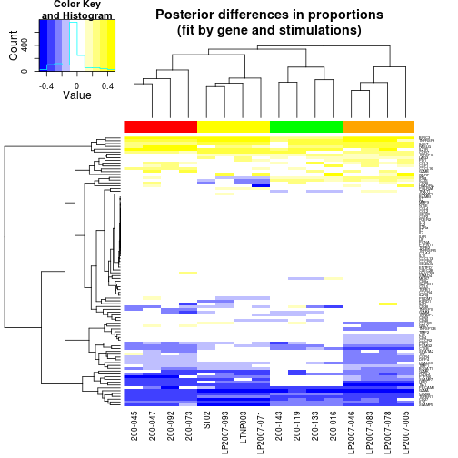
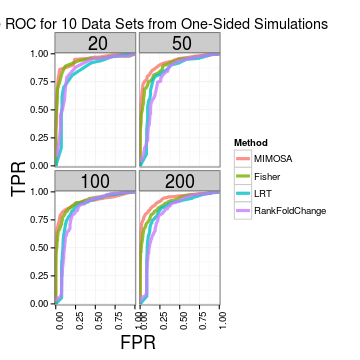
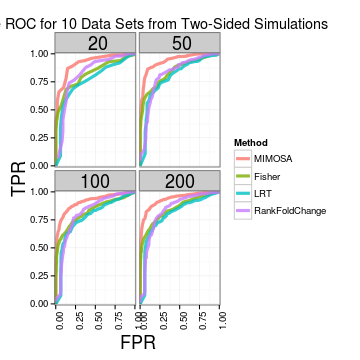
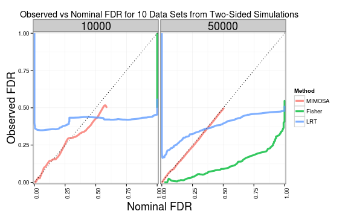
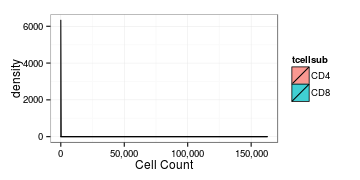

Load the data and fit the MIMOSA model
===============


```r
source("utility.R")
```


Read and merge the hvtn data. Cache it.


```r
hvtndata <- readHVTNData()
```


      

      

```r
hvtndata <- processHVTNData(hvtndata)
hvtndata <- constructEset(hvtndata)
```


read the fluidigm data


```r
fluidigm <- readFluidigmData()
```


Process it


```r
fluidigm <- processFluidigmData()
```


Fit the MIMOSA model to the HVTN data all cytokines and ENV-1-PTEG using EM and MCMC


```r
if (!file.exists("hvtnEMfit.rds")) {
    hvtn.result.EM <- MIMOSA(NSUB + CYTNUM ~ ASSAYID + VISITNO + PTID + RX_CODE + 
        RefTreat | TCELLSUB + ANTIGEN + CYTOKINE, hvtndata, ref = RefTreat %in% 
        "Reference" & ANTIGEN %in% "ENV-1-PTEG", subset = RefTreat %in% "Treatment" & 
        ANTIGEN %in% "ENV-1-PTEG", method = "EM", run.parallel = TRUE)
    saveRDS(hvtn.result.EM, file = "hvtnEMfit.rds")
} else {
    hvtn.result.EM <- readRDS("hvtnEMfit.rds")
}
if (!file.exists("hvtnMCMCfit.rds")) {
    hvtn.result.mcmc <- MIMOSA(NSUB + CYTNUM ~ ASSAYID + VISITNO + PTID + RX_CODE + 
        RefTreat | TCELLSUB + ANTIGEN + CYTOKINE, hvtndata, ref = RefTreat %in% 
        "Reference" & ANTIGEN %in% "ENV-1-PTEG", subset = RefTreat %in% "Treatment" & 
        ANTIGEN %in% "ENV-1-PTEG", method = "mcmc", run.parallel = TRUE, pXi = 0.1, 
        getP = TRUE)
    saveRDS(hvtn.result.mcmc, file = "hvtnMCMCfit.rds")
} else {
    hvtn.result.mcmc <- readRDS("hvtnMCMCfit.rds")
}
```


drop the stuff fit via mcmc and summarize, fit LRT, Fisher's and rank by log fold change


```r
hvtn.summary.EM <- summarizeMIMOSAFit(hvtn.result.EM)
hvtn.summary.EM <- subset(hvtn.summary.EM, Method %in% "EM")
hvtn.summary.mcmc <- summarizeMIMOSAFit(hvtn.result.mcmc)
hvtn.summary.mcmc <- FisherFromSummary(hvtn.summary.mcmc)
```

```
## Loading required package: doParallel
```

```
## Loading required package: iterators
```

```r
hvtn.summary.mcmc <- LRT(hvtn.summary.mcmc)
hvtn.summary.mcmc <- FoldChangeRank(hvtn.summary.mcmc)
```


Compute ROC and FDR curves and calculate the AUC.
+ cache=TRUE


```r
ROC <- ComputeROCs(hvtn.summary.mcmc, hvtn.summary.EM)
FDR <- ComputeFDRs(hvtn.summary.mcmc, hvtn.summary.EM)
AUC <- ComputeAUCs(ROC)
```


FDR and ROC plots
--------
We see that MIMOSA performs as well or better than competing methods. The MCMC routine performs better than the EM routine for some data.


```r
ROC$Method <- relevel(ROC$Method, "MIMOSA (EM)")
levs <- c("IFN-IL2-TNF+", "IFN-IL2+TNF-", "IFN-IL2+TNF+", "IFN+IL2-TNF-", "IFN+IL2-TNF+", 
    "IFN+IL2+TNF-", "IFN+IL2+TNF+", "IFNg+", "IFNg+IL2+", "IFNg+TNF+", "IL2+", 
    "IL2-IFNg+", "IL2+ OR IFNg+", "IL2+IFNg-", "IL2+IFNg+", "IL2+TNF+", "TNF+")
ROC$CYTOKINE <- factor(ROC$CYTOKINE, labels = levs)
AUC$CYTOKINE <- factor(AUC$CYTOKINE, labels = levs)
rocplots <- ggplot(subset(ROC, TCELLSUB %in% "cd3+/cd4+")) + geom_line(aes(x = FPR, 
    y = TPR, color = Method)) + theme_bw() + facet_wrap(~CYTOKINE) + geom_text(aes(x = x, 
    y = y, label = sprintf("AUC=%s", signif(AUC, 2)), col = Method), size = 3, 
    data = AUC, show_guide = FALSE) + theme(axis.text.x = element_text(angle = 90, 
    hjust = 1))
```

```r
FDR$Method <- relevel(FDR$Method, "MIMOSA (EM)")
levs <- levels(FDR$CYTOKINE)
levs <- c("IFN-IL2-TNF+", "IFN-IL2+TNF-", "IFN-IL2+TNF+", "IFN+IL2-TNF-", "IFN+IL2-TNF+", 
    "IFN+IL2+TNF-", "IFN+IL2+TNF+", "IFNg+", "IFNg+IL2+", "IFNg+TNF+", "IL2+", 
    "IL2-IFNg+", "IL2+ OR IFNg+", "IL2+IFNg-", "IL2+IFNg+", "IL2+TNF+", "TNF+")
FDR$CYTOKINE <- factor(FDR$CYTOKINE, labels = levs)
fdrplots <- ggplot(subset(FDR, TCELLSUB %in% c("cd3+/cd4+"))) + geom_line(aes(y = true.fdr, 
    x = fdr, color = Method)) + geom_abline(1, lty = 3) + theme_bw() + scale_x_continuous(name = "Nominal FDR") + 
    scale_y_continuous(name = "Observed FDR") + facet_wrap(~CYTOKINE) + theme(axis.text.x = element_text(angle = 90, 
    hjust = 1))
```


Figure 1 and S1. Write to Figures folder.
Don't evaluate here.


Process the fluidigm data to construct an expression set for MIMOSA
---------


```r
fl.bystim <- lapply(fluidigm, exprs)
cd.bystim <- lapply(fluidigm, cData)
fl <- lapply(names(fl.bystim), function(n) {
    m <- melt(cbind(fl.bystim[[n]], cd.bystim[[n]]), id = c("Stim.Agent", "Stim.Condition", 
        "Time.of.Stim", "Sero.Status", "Patient.ID", "Chip.Number", "Well", 
        "Number.of.Cells"))
    ddply(m, .(Stim.Condition, Patient.ID, variable), summarize, N = length(value), 
        n = sum(value > 0))
})
fl <- lapply(fl, function(x) setnames(x, "variable", "Gene"))
Esets.fluidigm <- lapply(fl, function(x) ConstructMIMOSAExpressionSet(x, reference = Stim.Condition %in% 
    "Unstim", measure.columns = c("N", "n"), other.annotations = c("Gene", "Patient.ID", 
    "Stim.Condition"), default.cast.formula = component ~ Patient.ID + Gene, 
    .variables = .(Patient.ID, Gene), featureCols = 1, ref.append.replace = "_REF"))
nms <- names(fl.bystim)
Esets.fluidigm <- lapply(1:length(Esets.fluidigm), function(x) {
    pData(Esets.fluidigm[[x]]) <- cbind(pData(Esets.fluidigm[[x]]), Stim = nms[x])
    Esets.fluidigm[[x]]
})
Eset.combined <- combine(Esets.fluidigm[[1]], Esets.fluidigm[[2]], Esets.fluidigm[[3]], 
    Esets.fluidigm[[4]])
```


Fit MIMOSA by gene, grouping by stimulation and for all samples together.
----


```r
if (!file.exists("fluidigm.fits.by.stim.allgenes.rds")) {
    fluidigm.fits.by.stim.allgenes <- lapply(list(Eset.combined), function(x) MIMOSA(N + 
        n ~ Stim + Patient.ID | Gene, x, ref = RefTreat %in% "Reference", subset = RefTreat %in% 
        "Treatment", method = "mcmc", EXPRATE = 1e-04, iter = 105000, burn = 5000, 
        pXi = 1, alternative = "not equal", run.parallel = TRUE, getP = TRUE))
    fluidigm.fits.by.stim.bygene <- mclapply(Esets.fluidigm, function(x) MIMOSA(N + 
        n ~ Stim + Patient.ID | Gene, x, ref = RefTreat %in% "Reference", subset = RefTreat %in% 
        "Treatment", method = "mcmc", EXPRATE = 1e-04, iter = 105000, burn = 50000, 
        pXi = 1, alternative = "not equal", getP = TRUE, run.parallel = TRUE))
    saveRDS(fluidigm.fits.by.stim.allgenes, file = "fluidigm.fits.by.stim.allgenes.rds")
    saveRDS(fluidigm.fits.by.stim.bygene, file = "fluidigm.fits.by.stim.bygene.rds")
} else {
    fluidigm.fits.by.stim.allgenes <- readRDS("fluidigm.fits.by.stim.allgenes.rds")
    fluidigm.fits.by.stim.bygene <- readRDS("fluidigm.fits.by.stim.bygene.rds")
}
```


Heatmap of posterior probabilities of response for fit of all samples by gene.
----
-Red and orange are CMV (pp65). Yellow and green are HIV (gag and nef).
-When fitting the data to all samples simultaneously, we still observe clustering of samples by stimulation (i.e. CMV stimulated samples cluster together, and HIV stimulated samples cluster together).


```r
foo <- do.call(rbind, lapply(fluidigm.fits.by.stim.allgenes[[1]], function(x) x@z[, 
    2]))
props <- do.call(rbind, lapply(fluidigm.fits.by.stim.allgenes[[1]], function(x) do.call(c, 
    lapply(x@result@p, function(x) -diff(x[, 2])))))
S <- sign(props)
S[S == 0] <- 1
colnames(S) <- pData(fluidigm.fits.by.stim.allgenes[[1]][[1]])[, c("Patient.ID")]
stim <- pData(fluidigm.fits.by.stim.allgenes[[1]][[1]])$Stim
rownames(S) <- do.call(rbind, lapply(fluidigm.fits.by.stim.allgenes[[1]], function(x) as.character(unique(pData(x)$Gene))))
heatmap.2((S * (foo))[apply(foo, 1, function(x) sum(x > 0.6) >= 1), ], col = colorpanel(n = 10, 
    high = "yellow", low = "blue", mid = "white"), margins = c(6, 5), cexRow = 0.5, 
    hclustfun = function(x) hclust(x, method = "complete"), trace = "none", 
    symbreaks = TRUE, ColSideColors = c("red", "orange", "yellow", "green")[as.numeric(stim)], 
    Colv = TRUE, main = "signed Posterior Probabilities\n(fit by gene, all stimulations)")
```

 


Figure 2 C, (fit of all samples simultaneously)


Heatmap of posterior differences of proportions fit by gene for all samples.
----
-Red and orange are CMV (pp65). Yellow and green are HIV (gag and nef).
-When fitting the data to all samples simultaneously, we still observe clustering of samples by stimulation (i.e. CMV stimulated samples cluster together, and HIV stimulated samples cluster together).


```r
colnames(props) <- colnames(S)
rownames(props) <- rownames(S)
heatmap.2(S * sqrt(abs(props)), col = colorpanel(n = 10, high = "yellow", low = "blue", 
    mid = "white"), margins = c(6, 5), cexRow = 0.5, hclustfun = function(x) hclust(x, 
    method = "complete"), trace = "none", symbreaks = TRUE, ColSideColors = c("red", 
    "orange", "yellow", "green")[as.numeric(stim)], Colv = TRUE, main = "Posterior Differences in Proportions\n(fit by gene all stimulations)")
```

 


Heatmap of posterior probability of response for fit of samples by stimulation and by gene
---
-Red and orange are CMV (pp65). Yellow and green are HIV (gag and nef).


```r
foo <- do.call(cbind, lapply(fluidigm.fits.by.stim.bygene, function(x) do.call(rbind, 
    lapply(x, function(x) x@z[, 2]))))
props <- do.call(cbind, lapply(fluidigm.fits.by.stim.bygene, function(x) do.call(rbind, 
    lapply(x, function(x) do.call(c, lapply(x@result@p, function(x) -diff(x[, 
        2])))))))
S <- sign(props)
colnames(S) <- do.call(c, lapply(fluidigm.fits.by.stim.bygene, function(x) as.character(pData(x[[1]])[, 
    c("Patient.ID")])))
S[S == 0] <- 1
stim <- as.numeric(factor(do.call(c, lapply(fluidigm.fits.by.stim.bygene, function(x) as.character(pData(x[[1]])$Stim)))))
colnames(S) <- do.call(c, lapply(fluidigm.fits.by.stim.bygene, function(x) as.character(pData(x[[1]])$Patient.ID)))
rownames(S) <- do.call(cbind, lapply(fluidigm.fits.by.stim.bygene[[1]], function(x) as.character(unique(pData(x)$Gene))))
h <- heatmap.2((S * foo)[apply(foo, 1, function(x) sum(x > 0.6) >= 1), ], col = colorpanel(n = 10, 
    high = "yellow", low = "blue", mid = "white"), margins = c(6, 5), cexRow = 0.5, 
    hclustfun = function(x) hclust(x, method = "complete"), trace = "none", 
    symbreaks = TRUE, ColSideColors = c("red", "orange", "yellow", "green")[as.numeric(stim)], 
    main = "Signed Posterior Probabilities\n(fit by gene and stimulation).")
```

 

```r
hmaporder <- h$colInd
geneinds <- apply(foo, 1, function(x) sum(x > 0.6) >= 1)
```


Figure 2 A


Heatmap of posterior differences in proportions for fit of samples by stimulation and by gene. 
---
-Red and orange are CMV (pp65). Yellow and green are HIV (gag and nef).


```r
colnames(props) <- colnames(S)
rownames(props) <- rownames(S)
heatmap.2(sqrt(abs(props)) * S, col = colorpanel(n = 10, high = "yellow", low = "blue", 
    mid = "white"), margins = c(6, 5), cexRow = 0.5, hclustfun = function(x) hclust(x, 
    method = "complete"), trace = "none", symbreaks = TRUE, ColSideColors = c("red", 
    "orange", "yellow", "green")[as.numeric(stim)], Colv = TRUE, main = "Posterior differences in proportions\n(fit by gene and stimulations)")
```

 


Fisher's exact test and heatmaps of -log10(q-values) from Fisher's
---
There is little clustering by stimulation evident from testing for differential expression with Fisher's exact test.


```r
fisher <- do.call(rbind, lapply(fluidigm.fits.by.stim.allgenes[[1]], function(x) {
    p <- vector("numeric", nrow(x@result@n.stim))
    for (i in 1:nrow(x@result@n.stim)) {
        p[i] <- fisher.test(as.matrix(rbind(x@result@n.stim[i, ], x@result@n.unstim[i, 
            ])), alternative = "two.sided")$p.value
    }
    p
}))
adj.fisher <- matrix(p.adjust(fisher, "fdr"), nrow = 96)
S <- sign(lapply(fluidigm.fits.by.stim.allgenes, function(x) do.call(rbind, 
    lapply(x, function(x) (prop.table(as.matrix(x@result@n.stim), 1) - prop.table(as.matrix(x@result@n.unstim), 
        1))[, 2])))[[1]])
S[S == 0] <- 1
colnames(fisher) <- gsub("_B3GAT1_Treatment", "", colnames(S))
rownames(fisher) <- do.call(rbind, lapply(fluidigm.fits.by.stim.allgenes[[1]], 
    function(x) as.character(unique(pData(x)$Gene))))
stim <- pData(fluidigm.fits.by.stim.allgenes[[1]][[1]])$Stim
heatmap.2(fisher * S, col = colorpanel(n = 10, high = "yellow", low = "blue", 
    mid = "white"), margins = c(6, 5), cexRow = 0.5, hclustfun = function(x) hclust(x, 
    method = "complete"), trace = "none", symbreaks = TRUE, ColSideColors = c("red", 
    "orange", "yellow", "green")[as.numeric(stim)], Colv = TRUE, main = "-log10(p-values)\nfrom Fisher's Exact Test")
```

 


Figure 2 D


Figure 2C empirical proportions


Multivariate MIMOSA on fluidigm data looking at interactions
---------
There is a difference when comparing stimulations and looking at the multivariate vector of expression for GZMK and CCR7 (i.e [+/+,+/-,-/+,--]), but no difference is detected when we look at expression of GZMK | CCR7, since one cell subset increases while the other decreases upon stimultion.


```r
fl.comb <- combine(fluidigm[[1]], fluidigm[[2]], fluidigm[[3]], fluidigm[[4]])
melted <- melt(fl.comb)
require(glmnet)
```

```
## Loading required package: glmnet
```

```
## Loading required package: Matrix
```

```
## Attaching package: 'Matrix'
```

```
## The following object is masked from 'package:pracma':
## 
## expm, lu, tril, triu
```

```
## The following object is masked from 'package:reshape':
## 
## expand
```

```
## Loaded glmnet 1.9-3
```

```r
require(Matrix)
melted$Et.bin <- as.numeric(as.logical(melted$Et))
# setnames(melted,'__wellKey','wellKey')
melted <- within(melted, group <- Patient.ID:Stim.Agent)
melted <- cast(melt(melted, id = c("group", "Stim.Condition", "primerid", "wellKey"), 
    measure = "Et.bin"), group + Stim.Condition + wellKey ~ primerid)

interact.scan <- combn(colnames(melted)[4:99], 2, function(x) {
    g1 <- x[1]
    g2 <- x[2]
    gg <- paste(g1, g2, sep = ":")
    bar <- data.frame(melted[, c("group", "Stim.Condition", g1, g2)])
    bar$foo <- factor(bar[, c(g1)]):factor(bar[, c(g2)])
    setnames(bar, "foo", gg)
    bar[, 5] <- factor(bar[, 5], levels = c("0:0", "0:1", "1:0", "1:1"))
    C <- cast(melt(bar, id = c("group", "Stim.Condition"), measure = c(gg)), 
        group + Stim.Condition ~ value, fun.aggregate = function(x) length(x))
    expected <- c("0:0", "0:1", "1:0", "1:1")
    unused <- setdiff(expected, colnames(C))
    newframe <- NULL
    for (i in seq_along(expected)) {
        if (expected[i] %in% unused) {
            newframe <- cbind(newframe, rep(0, nrow(C)))
        } else {
            newframe <- cbind(newframe, C[, expected[i]])
        }
    }
    colnames(newframe) <- expected
    C <- cbind(C[, 1:2], newframe)
    CC <- list(n.unstim = subset(C, Stim.Condition %in% "Unstim")[, -c(1:2)], 
        n.stim = subset(C, Stim.Condition %in% "Stim")[, -c(1:2)])
    foo <- lapply(CC, function(x) prop.table(as.matrix(x), 1))
    psum <- mean(rowSums(foo[[1]][, 2:4]) - rowSums(foo[[2]][, 2:4]))
    pij <- colMeans(foo[[1]][, 2:4] - foo[[2]][, 2:4])
    res <- c(psum, pij)
    res
})

genes <- combn(colnames(melted)[6:101], 2)[, which(abs(interact.scan[1, ]) < 
    0.01 & abs(interact.scan[4, ]) > 0.3)]
interact.scan[, which(abs(interact.scan[1, ]) < 0.01 & abs(interact.scan[4, 
    ]) > 0.3)]
```

```
##            [,1]      [,2]     [,3]      [,4]      [,5]       [,6]
## [1,] -0.0005292 -0.004509 -0.00195  0.003443  0.005868  0.0024208
## [2,]  0.4366895  0.432710  0.43527  0.440662  0.443087 -0.0006944
## [3,] -0.0036444 -0.051454 -0.01334 -0.007007 -0.000710 -0.4228723
## [4,] -0.4335743 -0.385764 -0.42388 -0.430211 -0.436509  0.4259875
##           [,7]
## [1,]  0.003701
## [2,] -0.421592
## [3,] -0.002877
## [4,]  0.428170
```

```r
ggg <- genes[, 6]
g1 <- ggg[1]
g2 <- ggg[2]  #CCR7 and GZMK
g1 <- "CCR7"
g2 <- "GZMK"
gg <- paste(g1, g2, sep = ":")
bar <- data.frame(melted[, c("group", "Stim.Condition", g1, g2)])
bar$foo <- factor(bar[, c(g1)]):factor(bar[, c(g2)])
setnames(bar, "foo", gg)
C <- cast(melt(bar, id = c("group", "Stim.Condition"), measure = c(gg)), group + 
    Stim.Condition ~ value, fun.aggregate = function(x) length(x))
CC <- list(n.unstim = subset(C, Stim.Condition %in% "Unstim")[, -c(1:2)], n.stim = subset(C, 
    Stim.Condition %in% "Stim")[, -c(1:2)])

toplot <- data.frame(rbind(data.frame(CC$n.stim), data.frame(CC$n.unstim)), 
    stim = c(rep("Stim", nrow(CC$n.stim)), rep("Unstim", nrow(CC$n.unstim))))
toplot$id <- rep(unlist(lapply(strsplit(as.character(subset(C, Stim.Condition %in% 
    "Unstim")[, 1]), ":"), function(x) x[1]), use.names = FALSE), 2)
colnames(toplot)[1:4] <- gsub("X", "", paste(g1, g2, colnames(toplot)[1:4], 
    sep = ":"))
toplot <- melt(toplot, id = c("id", "stim"))
p1 <- ggplot(toplot) + geom_tile(aes(x = variable, y = id, fill = log2(value)), 
    interpolate = FALSE) + theme_bw() + theme(axis.text.x = element_text(angle = 90)) + 
    facet_wrap(~stim) + scale_fill_continuous(na.value = "gray")


DD <- CC
DD[[1]] <- cbind(CC[[1]][, 1], rowSums(CC[[1]][, 2:4]))
DD[[2]] <- cbind(CC[[2]][, 1], rowSums(CC[[2]][, 2:4]))
toplot2 <- data.frame(rbind(data.frame(DD$n.stim), data.frame(DD$n.unstim)), 
    stim = c(rep("Stim", nrow(DD$n.stim)), rep("Unstim", nrow(DD$n.unstim))))
toplot2$id <- rep(unlist(lapply(strsplit(as.character(subset(C, Stim.Condition %in% 
    "Unstim")[, 1]), ":"), function(x) x[1]), use.names = FALSE), 2)
colnames(toplot2)[1:2] <- gsub("X", "", paste(g1, g2, colnames(toplot2)[1:2], 
    sep = ":"))
toplot2 <- melt(toplot2, id = c("id", "stim"))
p2 <- ggplot(toplot2) + geom_tile(aes(x = variable, y = id, fill = log2(value)), 
    interpolate = FALSE) + theme_bw() + theme(axis.text.x = element_text(angle = 90)) + 
    facet_wrap(~stim) + scale_fill_continuous(na.value = "gray")
```


Figure 4


Simulations
==========
One sided
------
We'll use the model fit from IFNg+ for ENV-1-PTEG based on the ROC and FDR plots
Note that MIMOSA has greater sensitivity and specificity than Fisher's exact test or the Likelihood ratio test. When there are 5 observations, the methods being to perform equivalently.

      


Two-sided
--------

      


Figure 3


Multivariate Simulations
-----
Average ROC for 10 multivariate simulations with effect size of 2.5x10-3 and -2.5x10-3 in two of eight components (N=4743 events).


```r
set.seed(101)
as <- c(1, 1, 1, 1, 3.5, 1, 1)
au <- c(1, 1, 1, 1, 1, 3.5, 1)
as <- c(1000 - sum(as), as) * 100
au <- c(1000 - sum(au), au) * 100
if (!file.exists("mvsims.rds")) {
    mdsim <- sapply(1:10, function(i) {
        simd <- MIMOSA:::simMD(alpha.s = as, alpha.u = au, N = 100, w = 0.5, 
            n = 3.5, alternative = "not equal")
        foo <- .fitMCMC(simd, inits = MIMOSA:::MDMix(simd, initonly = TRUE))
        foo
    })
    saveRDS(mdsim, file = "mvsims.rds")
} else {
    mdsim <- readRDS("mvsims.rds")
}
fisher.p <- vector("list", ncol(mdsim))
for (i in 1:ncol(mdsim)) {
    fisher.p[[i]] <- rep(NA, nrow(mdsim[, i]$n.stim))
    for (j in 1:nrow(mdsim[, i]$n.stim)) {
        fisher.p[[i]][j] <- fisher.test(cbind(mdsim[, i]$n.stim[j, ], mdsim[, 
            i]$n.unstim[j, ]), alternative = "two.sided", simulate.p.value = TRUE)$p
    }
}

ROCfun <- function(x, truth) {
    o <- order(x, decreasing = FALSE)
    cbind(tpr = cumsum(truth[o])/sum(truth), fpr = cumsum(!truth[o])/sum(!truth))
}

fisher.p.adj <- lapply(fisher.p, function(x) p.adjust(x, "fdr"))
fisher.roc <- do.call(rbind, by(cbind(do.call(rbind, lapply(fisher.p.adj, function(i) ROCfun(i, 
    gl(2, 50) == 2)))), rep(gl(100, 1), 10), function(x) colMeans(x)))
mimosa.adj <- lapply(1:ncol(mdsim), function(i) MIMOSA:::fdr(mdsim[, i]$z))
MIMOSA.roc <- do.call(rbind, by(do.call(rbind, lapply(mimosa.adj, function(i) ROCfun(i, 
    gl(2, 50) == 2))), rep(gl(100, 1), 10), function(x) colMeans(x)))
foo <- data.frame(as.data.frame(rbind(fisher.roc, MIMOSA.roc)), Method = gl(2, 
    100, labels = c("Fisher", "MIMOSA")))
```

```
## Warning: some row.names duplicated:
## 101,102,103,104,105,106,107,108,109,110,111,112,113,114,115,116,117,118,119,120,121,122,123,124,125,126,127,128,129,130,131,132,133,134,135,136,137,138,139,140,141,142,143,144,145,146,147,148,149,150,151,152,153,154,155,156,157,158,159,160,161,162,163,164,165,166,167,168,169,170,171,172,173,174,175,176,177,178,179,180,181,182,183,184,185,186,187,188,189,190,191,192,193,194,195,196,197,198,199,200
## --> row.names NOT used
```

```r
sz <- element_text(size = 18)
p1 <- ggplot(foo) + geom_line(aes(x = fpr, y = tpr, col = Method)) + scale_y_continuous("TPR") + 
    scale_x_continuous("FPR") + theme_bw() + theme(axis.title.x = sz, axis.title.y = sz, 
    axis.text.x = sz, axis.text.y = sz)
# FDR
mim.fdr <- as.data.frame(cbind(do.call(rbind, lapply(mimosa.adj, function(x) fdrCurves(x, 
    gl(2, 50) == 2))), rep = gl(100, 1)))
ddply(mim.fdr, .(rep), summarize, true.fdr.hat = mean(true.fdr), fdr.hat = mean(fdr))
```

```
##     rep true.fdr.hat   fdr.hat
## 1     1     0.000000 2.151e-11
## 2     2     0.000000 6.751e-11
## 3     3     0.000000 1.269e-10
## 4     4     0.000000 3.763e-10
## 5     5     0.000000 7.297e-10
## 6     6     0.000000 1.227e-09
## 7     7     0.000000 1.807e-09
## 8     8     0.000000 3.499e-09
## 9     9     0.000000 5.601e-09
## 10   10     0.000000 9.302e-09
## 11   11     0.000000 1.328e-08
## 12   12     0.000000 1.753e-08
## 13   13     0.000000 2.218e-08
## 14   14     0.000000 2.778e-08
## 15   15     0.000000 3.609e-08
## 16   16     0.000000 4.670e-08
## 17   17     0.000000 5.763e-08
## 18   18     0.000000 7.252e-08
## 19   19     0.000000 8.945e-08
## 20   20     0.000000 1.103e-07
## 21   21     0.000000 1.332e-07
## 22   22     0.000000 1.610e-07
## 23   23     0.000000 1.930e-07
## 24   24     0.000000 2.305e-07
## 25   25     0.000000 2.775e-07
## 26   26     0.000000 3.437e-07
## 27   27     0.000000 4.299e-07
## 28   28     0.000000 5.294e-07
## 29   29     0.000000 6.484e-07
## 30   30     0.000000 7.961e-07
## 31   31     0.000000 1.022e-06
## 32   32     0.000000 1.310e-06
## 33   33     0.000000 1.680e-06
## 34   34     0.000000 2.123e-06
## 35   35     0.000000 2.692e-06
## 36   36     0.000000 3.728e-06
## 37   37     0.000000 4.944e-06
## 38   38     0.000000 6.661e-06
## 39   39     0.000000 9.095e-06
## 40   40     0.000000 1.227e-05
## 41   41     0.000000 1.616e-05
## 42   42     0.000000 2.270e-05
## 43   43     0.000000 4.244e-05
## 44   44     0.000000 7.107e-05
## 45   45     0.000000 1.250e-04
## 46   46     0.000000 2.132e-04
## 47   47     0.000000 3.859e-04
## 48   48     0.000000 7.987e-04
## 49   49     0.002041 1.728e-03
## 50   50     0.012000 8.023e-03
## 51   51     0.021569 2.032e-02
## 52   52     0.038462 3.652e-02
## 53   53     0.056604 5.379e-02
## 54   54     0.074074 7.099e-02
## 55   55     0.090909 8.774e-02
## 56   56     0.107143 1.039e-01
## 57   57     0.122807 1.196e-01
## 58   58     0.137931 1.348e-01
## 59   59     0.152542 1.495e-01
## 60   60     0.166667 1.636e-01
## 61   61     0.180328 1.773e-01
## 62   62     0.193548 1.906e-01
## 63   63     0.206349 2.034e-01
## 64   64     0.218750 2.159e-01
## 65   65     0.230769 2.280e-01
## 66   66     0.242424 2.397e-01
## 67   67     0.253731 2.510e-01
## 68   68     0.264706 2.620e-01
## 69   69     0.275362 2.727e-01
## 70   70     0.285714 2.831e-01
## 71   71     0.295775 2.932e-01
## 72   72     0.305556 3.030e-01
## 73   73     0.315068 3.126e-01
## 74   74     0.324324 3.218e-01
## 75   75     0.333333 3.309e-01
## 76   76     0.342105 3.397e-01
## 77   77     0.350649 3.483e-01
## 78   78     0.358974 3.566e-01
## 79   79     0.367089 3.648e-01
## 80   80     0.375000 3.727e-01
## 81   81     0.382716 3.805e-01
## 82   82     0.390244 3.880e-01
## 83   83     0.397590 3.954e-01
## 84   84     0.404762 4.026e-01
## 85   85     0.411765 4.096e-01
## 86   86     0.418605 4.165e-01
## 87   87     0.425287 4.232e-01
## 88   88     0.431818 4.297e-01
## 89   89     0.438202 4.361e-01
## 90   90     0.444444 4.424e-01
## 91   91     0.450549 4.485e-01
## 92   92     0.456522 4.545e-01
## 93   93     0.462366 4.604e-01
## 94   94     0.468085 4.661e-01
## 95   95     0.473684 4.718e-01
## 96   96     0.479167 4.773e-01
## 97   97     0.484536 4.826e-01
## 98   98     0.489796 4.879e-01
## 99   99     0.494949 4.931e-01
## 100 100     0.500000 4.982e-01
```

```r
fisher.fdr <- as.data.frame(cbind(do.call(rbind, lapply(fisher.p.adj, function(x) fdrCurves(x, 
    gl(2, 50) == 2))), rep = gl(100, 1)))
plot(ddply(mim.fdr, .(rep), summarize, true.fdr.hat = mean(true.fdr), fdr.hat = mean(fdr)))
```

 


Figure 5


Competing ROC curves to evaluate the effect of inaccuracies in the true positives and false positives.
-----
Simulate from models with 20,35,50,65,80 percent response rates but treat the ROC evaluation as 100% response.


```r
comproc <- CompareROC(hvtn.result.mcmc)
comproc[[1]]$true.resp.rate <- as.numeric(as.character(comproc[[1]]$q)) * 2
comproc[[2]]$true.resp.rate <- as.numeric(as.character(comproc[[2]]$q)) * 2

p8 <- ggplot(comproc[[1]]) + geom_line(aes(x = fdr.hat, y = true.fdr.hat, color = method)) + 
    facet_wrap(~true.resp.rate, ncol = 5) + theme_bw() + geom_abline(1, lty = 3) + 
    labs(title = "Observed vs True FDR when \ntrue response rate varies but is assumed to be 100%") + 
    theme(axis.text.x = element_text(angle = 90))
p9 <- ggplot(comproc[[2]]) + geom_line(aes(x = FPR.hat, y = TPR.hat, color = method)) + 
    facet_wrap(~true.resp.rate, ncol = 5) + theme_bw() + labs(title = "ROC curves when \ntrue response rate varies but is assumed to be 100%") + 
    scale_x_continuous("False Positive Rate") + scale_y_continuous("True Positive Rate") + 
    theme(axis.text.x = element_text(angle = 90))

library(gridExtra)
pdf(file = "/Users/gfinak/Documents/manuscripts/MIMOSA_Paper/Figures/competeROC.pdf", 
    width = 10, height = 3)
```

```
## Error: cannot open file
## '/Users/gfinak/Documents/manuscripts/MIMOSA_Paper/Figures/competeROC.pdf'
```

```r
p9
```

 

```r
dev.off()
```

 

```r
p9
```

 

```r
pdf(file = "/Users/gfinak/Documents/manuscripts/MIMOSA_Paper/Figures/competeROCfdr.pdf", 
    width = 10, height = 3)
```

```
## Error: cannot open file
## '/Users/gfinak/Documents/manuscripts/MIMOSA_Paper/Figures/competeROCfdr.pdf'
```

```r
p8
```

 

```r
dev.off()
p8
```


Supplementary Figure 2
------
Histogram of the empirical proportions of unstimulated cells and overlaid posterior densities of the beta distribution with $\alpha_s$ and $\alpha_u$ estimated from the data for ENV-1-PTEG stimulated, IFN-$\gamma$+ CD4+ T-cells, demonstrating that the assumption of a common distribution for piu across subjects is reasonable.

 


Unconstrained MIMOSA fit to data violating model assumptions
-----

  


Figure S3


Figure of effect size vs probability of response


```r
pd <- do.call(rbind, lapply(hvtn.result.mcmc, function(x) pData(x)))
pd <- cbind(pd, do.call(rbind, lapply(hvtn.result.mcmc, function(x) data.frame(response = MIMOSA:::fdr(x@z) < 
    0.01, Prob.resp = x@z[, 2], effect = do.call(c, lapply(x@result@p, function(x) diff(rev(x[, 
    2]))))))))
pd$VACCINE <- factor(pd$RX_CODE %in% c("T1", "T2", "T3", "T4"))
pdf(file = "/Users/gfinak/Documents/manuscripts/MIMOSA_Paper/Figures/volcanoplots.pdf", 
    width = 15, height = 10)
```

```
## Error: cannot open file
## '/Users/gfinak/Documents/manuscripts/MIMOSA_Paper/Figures/volcanoplots.pdf'
```

```r
ggplot(subset(pd, TCELLSUB %in% "cd3+/cd4+")) + geom_point(aes(x = effect, y = Prob.resp, 
    color = response, shape = VISITNO:VACCINE)) + facet_wrap(TCELLSUB ~ CYTOKINE, 
    scale = "free_x") + theme(axis.text.x = element_text(angle = 90)) + scale_color_discrete("Response", 
    labels = c("No", "Yes")) + theme_bw()
```

 

```r
dev.off()
```

```
## pdf 
##   2
```

```r
ggplot(subset(pd, TCELLSUB %in% "cd3+/cd4+")) + geom_point(aes(x = effect, y = Prob.resp, 
    color = response, shape = VISITNO:VACCINE)) + facet_wrap(TCELLSUB ~ CYTOKINE, 
    scale = "free_x") + theme(axis.text.x = element_text(angle = 90)) + scale_color_discrete("Response", 
    labels = c("No", "Yes")) + theme_bw()
```


How many CD4 and CD8 T-cells?
-----


```
## Error: arguments imply differing number of rows: 1, 224, 205
```

```
## Error: attempt to replicate an object of type 'closure'
```

```
## Error: ggplot2 doesn't know how to deal with data of class function
```


Table of median cell counts for different subsets
-----


```
## Error: error in evaluating the argument 'data' in selecting a method for
## function 'melt': Error in if (empty(.data)) return(.data) : missing value
## where TRUE/FALSE needed
```

```
## Error: error in evaluating the argument 'x' in selecting a method for
## function 'print': Error in xtable(d[, -1L], display = c("fg", "fg", "fg"))
## : object 'd' not found
```


Magnitude of the proportions for the HVTN data
----

 


Table of median cell proportions for HVTN data
----

<!-- html table generated in R 3.0.1 by xtable 1.7-1 package -->
<!-- Tue Jun 25 09:05:06 2013 -->
<TABLE border=1>
<TR> <TH> CD4 </TH> <TH> CD8 </TH>  </TR>
  <TR> <TD align="right"> 0.00022 </TD> <TD align="right"> 0.0000017 </TD> </TR>
   </TABLE>


