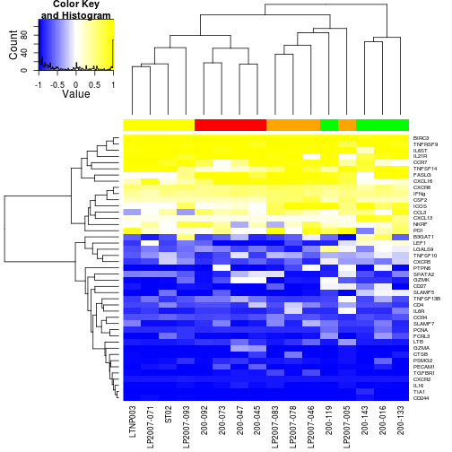
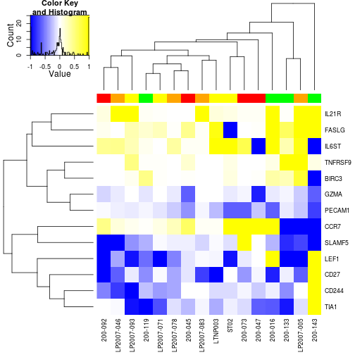
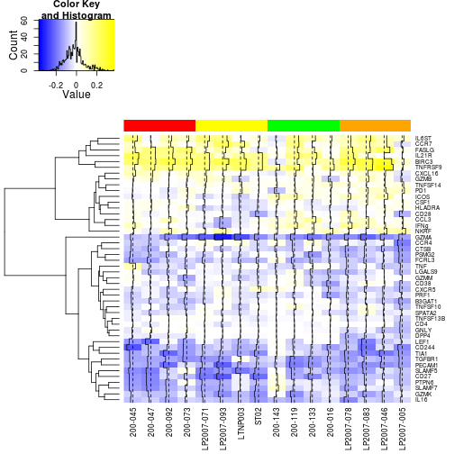
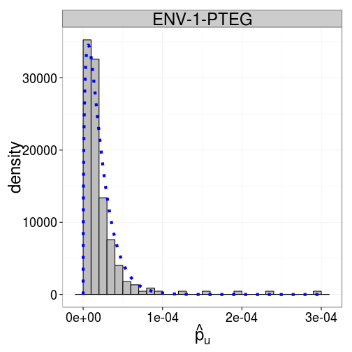

Load the data and fit the MIMOSA model
===============


```r
source("utility.R")
```


### Read and merge the hvtn data.


```r
hvtndata <- readHVTNData()
```


      

      

```r
hvtndata <- processHVTNData(hvtndata)
hvtndata <- constructEset(hvtndata)
```


### Read the fluidigm data.


```r
fluidigm <- readFluidigmData()
```


Process it.


```r
fluidigm <- processFluidigmData()
```


### Fit the MIMOSA model to the HVTN data all cytokines and ENV-1-PTEG using EM and MCMC implementations.


```r
if (!file.exists("hvtnEMfit.rds")) {
    hvtn.result.EM <- MIMOSA(NSUB + CYTNUM ~ ASSAYID + VISITNO + PTID + RX_CODE + 
        RefTreat | TCELLSUB + ANTIGEN + CYTOKINE, hvtndata, ref = RefTreat %in% 
        "Reference" & ANTIGEN %in% "ENV-1-PTEG", subset = RefTreat %in% "Treatment" & 
        ANTIGEN %in% "ENV-1-PTEG", method = "EM", run.parallel = TRUE)
    saveRDS(hvtn.result.EM, file = "hvtnEMfit.rds")
} else {
    hvtn.result.EM <- readRDS("hvtnEMfit.rds")
}
if (!file.exists("hvtnMCMCfit.rds")) {
    hvtn.result.mcmc <- MIMOSA(NSUB + CYTNUM ~ ASSAYID + VISITNO + PTID + RX_CODE + 
        RefTreat | TCELLSUB + ANTIGEN + CYTOKINE, hvtndata, ref = RefTreat %in% 
        "Reference" & ANTIGEN %in% "ENV-1-PTEG", subset = RefTreat %in% "Treatment" & 
        ANTIGEN %in% "ENV-1-PTEG", method = "mcmc", run.parallel = TRUE, pXi = 0.1, 
        getP = TRUE)
    saveRDS(hvtn.result.mcmc, file = "hvtnMCMCfit.rds")
} else {
    hvtn.result.mcmc <- readRDS("hvtnMCMCfit.rds")
}
```


### Summarize the results. Do the likelihood ratio test, Fisher's test, and rank by log fold change for comparison.


```r
hvtn.summary.EM <- summarizeMIMOSAFit(hvtn.result.EM)
hvtn.summary.EM <- subset(hvtn.summary.EM, Method %in% "EM")
hvtn.summary.mcmc <- summarizeMIMOSAFit(hvtn.result.mcmc)
hvtn.summary.mcmc <- FisherFromSummary(hvtn.summary.mcmc)
hvtn.summary.mcmc <- LRT(hvtn.summary.mcmc)
hvtn.summary.mcmc <- FoldChangeRank(hvtn.summary.mcmc)
```


### Compute ROC and FDR curves and calculate the AUC for all the results.


```r
ROC <- ComputeROCs(hvtn.summary.mcmc, hvtn.summary.EM)
FDR <- ComputeFDRs(hvtn.summary.mcmc, hvtn.summary.EM)
AUC <- ComputeAUCs(ROC)
```


### FDR and ROC plots of the ICS data.
--------
We see that MIMOSA performs as well or better than competing methods. The MCMC routine performs better than the EM routine for some data.


```r
ROC$Method <- relevel(ROC$Method, "MIMOSA (EM)")
levs <- c("IFN-IL2-TNF+", "IFN-IL2+TNF-", "IFN-IL2+TNF+", "IFN+IL2-TNF-", "IFN+IL2-TNF+", 
    "IFN+IL2+TNF-", "IFN+IL2+TNF+", "IFNg+", "IFNg+IL2+", "IFNg+TNF+", "IL2+", 
    "IL2-IFNg+", "IL2+ OR IFNg+", "IL2+IFNg-", "IL2+IFNg+", "IL2+TNF+", "TNF+")
ROC$CYTOKINE <- factor(ROC$CYTOKINE, labels = levs)
AUC$CYTOKINE <- factor(AUC$CYTOKINE, labels = levs)
rocplots <- ggplot(subset(ROC, TCELLSUB %in% "cd3+/cd4+")) + geom_line(aes(x = FPR, 
    y = TPR, color = Method)) + theme_bw() + facet_wrap(~CYTOKINE) + geom_text(aes(x = x, 
    y = y, label = sprintf("AUC=%s", signif(AUC, 2)), col = Method), size = 3, 
    data = AUC, show_guide = FALSE) + theme(axis.text.x = element_text(angle = 90, 
    hjust = 1))
```

```r
FDR$Method <- relevel(FDR$Method, "MIMOSA (EM)")
levs <- levels(FDR$CYTOKINE)
levs <- c("IFN-IL2-TNF+", "IFN-IL2+TNF-", "IFN-IL2+TNF+", "IFN+IL2-TNF-", "IFN+IL2-TNF+", 
    "IFN+IL2+TNF-", "IFN+IL2+TNF+", "IFNg+", "IFNg+IL2+", "IFNg+TNF+", "IL2+", 
    "IL2-IFNg+", "IL2+ OR IFNg+", "IL2+IFNg-", "IL2+IFNg+", "IL2+TNF+", "TNF+")
FDR$CYTOKINE <- factor(FDR$CYTOKINE, labels = levs)
fdrplots <- ggplot(subset(FDR, TCELLSUB %in% c("cd3+/cd4+"))) + geom_line(aes(y = true.fdr, 
    x = fdr, color = Method)) + geom_abline(1, lty = 3) + theme_bw() + scale_x_continuous(name = "Nominal FDR") + 
    scale_y_continuous(name = "Observed FDR") + facet_wrap(~CYTOKINE) + theme(axis.text.x = element_text(angle = 90, 
    hjust = 1))
rocplots
```

 

```r
fdrplots
```

 


### Figure 1 and S1. 


### Process the fluidigm data to construct an expression set for MIMOSA.
---------


```r
fl.bystim <- lapply(fluidigm, exprs)
cd.bystim <- lapply(fluidigm, cData)
fl <- lapply(names(fl.bystim), function(n) {
    m <- melt(cbind(fl.bystim[[n]], cd.bystim[[n]]), id = c("Stim.Agent", "Stim.Condition", 
        "Time.of.Stim", "Sero.Status", "Patient.ID", "Chip.Number", "Well", 
        "Number.of.Cells"))
    ddply(m, .(Stim.Condition, Patient.ID, variable), summarize, N = length(value), 
        n = sum(value > 0))
})
fl <- lapply(fl, function(x) setnames(x, "variable", "Gene"))
Esets.fluidigm <- lapply(fl, function(x) ConstructMIMOSAExpressionSet(x, reference = Stim.Condition %in% 
    "Unstim", measure.columns = c("N", "n"), other.annotations = c("Gene", "Patient.ID", 
    "Stim.Condition"), default.cast.formula = component ~ Patient.ID + Gene, 
    .variables = .(Patient.ID, Gene), featureCols = 1, ref.append.replace = "_REF"))
nms <- names(fl.bystim)
Esets.fluidigm <- lapply(1:length(Esets.fluidigm), function(x) {
    pData(Esets.fluidigm[[x]]) <- cbind(pData(Esets.fluidigm[[x]]), Stim = nms[x])
    Esets.fluidigm[[x]]
})
Eset.combined <- combine(Esets.fluidigm[[1]], Esets.fluidigm[[2]], Esets.fluidigm[[3]], 
    Esets.fluidigm[[4]])
```


### Fit MIMOSA by gene, grouping by stimulation and for all samples together.
----


```r
if (!file.exists("fluidigm.fits.by.stim.allgenes.rds")) {
    fluidigm.fits.by.stim.allgenes <- lapply(list(Eset.combined), function(x) MIMOSA(N + 
        n ~ Stim + Patient.ID | Gene, x, ref = RefTreat %in% "Reference", subset = RefTreat %in% 
        "Treatment", method = "mcmc", EXPRATE = 1e-04, iter = 105000, burn = 5000, 
        pXi = 1, alternative = "not equal", run.parallel = TRUE, getP = TRUE))
    fluidigm.fits.by.stim.bygene <- mclapply(Esets.fluidigm, function(x) MIMOSA(N + 
        n ~ Stim + Patient.ID | Gene, x, ref = RefTreat %in% "Reference", subset = RefTreat %in% 
        "Treatment", method = "mcmc", EXPRATE = 1e-04, iter = 105000, burn = 50000, 
        pXi = 1, alternative = "not equal", getP = TRUE, run.parallel = TRUE))
    saveRDS(fluidigm.fits.by.stim.allgenes, file = "fluidigm.fits.by.stim.allgenes.rds")
    saveRDS(fluidigm.fits.by.stim.bygene, file = "fluidigm.fits.by.stim.bygene.rds")
} else {
    fluidigm.fits.by.stim.allgenes <- readRDS("fluidigm.fits.by.stim.allgenes.rds")
    fluidigm.fits.by.stim.bygene <- readRDS("fluidigm.fits.by.stim.bygene.rds")
}
```


### Heatmaps for Fluidigm data fit to all stimulations simultaneously.
----
-Red and orange are CMV (pp65). Yellow and green are HIV (gag and nef).
-When fitting the data to all samples simultaneously, we still observe clustering of samples by stimulation (i.e. CMV stimulated samples cluster together, and HIV stimulated samples cluster together).


```r
foo <- do.call(rbind, lapply(fluidigm.fits.by.stim.allgenes[[1]], function(x) x@z[, 
    2]))
props <- do.call(rbind, lapply(fluidigm.fits.by.stim.allgenes[[1]], function(x) do.call(c, 
    lapply(x@result@p, function(x) -diff(x[, 2])))))
S <- sign(props)
S[S == 0] <- 1
colnames(S) <- pData(fluidigm.fits.by.stim.allgenes[[1]][[1]])[, c("Patient.ID")]
stim <- pData(fluidigm.fits.by.stim.allgenes[[1]][[1]])$Stim
rownames(S) <- do.call(rbind, lapply(fluidigm.fits.by.stim.allgenes[[1]], function(x) as.character(unique(pData(x)$Gene))))
#
# heatmap.2((S*(foo))[apply(foo,1,function(x)sum(x>0.6)>=1),],col=colorpanel(n=10,high='yellow',low='blue',mid='white'),margins=c(6,5),cexRow=0.5,hclustfun=function(x)hclust(x,method='complete'),trace='none',symbreaks=TRUE,ColSideColors=c('red','orange','yellow','green')[as.numeric(stim)],Colv=TRUE,main='signed
# Posterior Probabilities\n(fit by gene, all stimulations)')
foo2 <- apply(foo, 2, function(x) MIMOSA:::fdr(cbind(1 - x, x)))
heatmap.2((S * (foo))[apply(foo2, 1, function(x) sum(x < 0.1) >= 1), ], col = colorpanel(n = 100, 
    high = "yellow", low = "blue", mid = "white"), margins = c(6, 5), cexRow = 0.75, 
    hclustfun = function(x) hclust(x, method = "complete"), trace = "none", 
    symbreaks = TRUE, ColSideColors = c("red", "orange", "yellow", "green")[as.numeric(stim)], 
    Colv = TRUE, denscol = "black")
```

 


### Figure 2 C, (fit of all samples simultaneously)


Heatmap of posterior differences in proportions from simultaneous fit (not shown).
----
-Red and orange are CMV (pp65). Yellow and green are HIV (gag and nef).
-When fitting the data to all samples simultaneously, we still observe clustering of samples by stimulation (i.e. CMV stimulated samples cluster together, and HIV stimulated samples cluster together).


### Heatmaps for Fluidigm data fit per stimulation.
---
-Red and orange are CMV (pp65). Yellow and green are HIV (gag and nef).


```r
foo <- do.call(cbind, lapply(fluidigm.fits.by.stim.bygene, function(x) do.call(rbind, 
    lapply(x, function(x) x@z[, 2]))))
props <- do.call(cbind, lapply(fluidigm.fits.by.stim.bygene, function(x) do.call(rbind, 
    lapply(x, function(x) do.call(c, lapply(x@result@p, function(x) -diff(x[, 
        2])))))))
S <- sign(props)
colnames(S) <- do.call(c, lapply(fluidigm.fits.by.stim.bygene, function(x) as.character(pData(x[[1]])[, 
    c("Patient.ID")])))
S[S == 0] <- 1
stim <- as.numeric(factor(do.call(c, lapply(fluidigm.fits.by.stim.bygene, function(x) as.character(pData(x[[1]])$Stim)))))
colnames(S) <- do.call(c, lapply(fluidigm.fits.by.stim.bygene, function(x) as.character(pData(x[[1]])$Patient.ID)))
rownames(S) <- do.call(cbind, lapply(fluidigm.fits.by.stim.bygene[[1]], function(x) as.character(unique(pData(x)$Gene))))
#
# h<-heatmap.2((S*foo)[apply(foo,1,function(x)sum(x>.6)>=1),],col=colorpanel(n=10,high='yellow',low='blue',mid='white'),margins=c(6,5),cexRow=0.5,hclustfun=function(x)hclust(x,method='complete'),trace='none',symbreaks=TRUE,ColSideColors=c('red','orange','yellow','green')[as.numeric(stim)],main='Signed
# Posterior Probabilities\n(fit by gene and stimulation).')
foo2 <- apply(foo, 2, function(x) MIMOSA:::fdr(cbind(1 - x, x)))
h <- heatmap.2((S * (foo))[apply(foo2, 1, function(x) sum(x < 0.1) >= 1), ], 
    col = colorpanel(n = 100, high = "yellow", low = "blue", mid = "white"), 
    margins = c(6, 5), cexRow = 0.75, hclustfun = function(x) hclust(x, method = "complete"), 
    trace = "none", symbreaks = TRUE, ColSideColors = c("red", "orange", "yellow", 
        "green")[as.numeric(stim)], Colv = TRUE, denscol = "black")
```

 

```r
hmaporder <- h$colInd
geneinds <- apply(foo, 1, function(x) sum(x > 0.6) >= 1)
```


### Figure 2 A (fit per stimulation)
Fit MIMOSA per stimulation.


Heatmap of posterior differences in proportions for fit of samples by stimulation and by gene (not shown).
---
-Red and orange are CMV (pp65). Yellow and green are HIV (gag and nef).


### Fisher's exact test and heatmaps of -log10(q-values) from Fisher's test.
---
There is little clustering by stimulation evident from testing for differential expression with Fisher's exact test.


```r
fisher <- do.call(rbind, lapply(fluidigm.fits.by.stim.allgenes[[1]], function(x) {
    p <- vector("numeric", nrow(x@result@n.stim))
    for (i in 1:nrow(x@result@n.stim)) {
        p[i] <- fisher.test(as.matrix(rbind(x@result@n.stim[i, ], x@result@n.unstim[i, 
            ])), alternative = "two.sided")$p.value
    }
    p
}))
adj.fisher <- matrix(p.adjust(fisher, "fdr"), nrow = 96)
S <- sign(lapply(fluidigm.fits.by.stim.allgenes, function(x) do.call(rbind, 
    lapply(x, function(x) (prop.table(as.matrix(x@result@n.stim), 1) - prop.table(as.matrix(x@result@n.unstim), 
        1))[, 2])))[[1]])
S[S == 0] <- 1
colnames(fisher) <- gsub("_B3GAT1_Treatment", "", colnames(S))
rownames(fisher) <- do.call(rbind, lapply(fluidigm.fits.by.stim.allgenes[[1]], 
    function(x) as.character(unique(pData(x)$Gene))))
stim <- pData(fluidigm.fits.by.stim.allgenes[[1]][[1]])$Stim
#
# heatmap.2(fisher*S,col=colorpanel(n=10,high='yellow',low='blue',mid='white'),margins=c(6,5),cexRow=0.5,hclustfun=function(x)hclust(x,method='complete'),trace='none',symbreaks=TRUE,ColSideColors=c('red','orange','yellow','green')[as.numeric(stim)],Colv=TRUE,main='-log10(p-values)\nfrom
# Fisher's Exact Test')
colnames(adj.fisher) <- colnames(fisher)
rownames(adj.fisher) <- rownames(fisher)
heatmap.2((((adj.fisher)) * S)[apply(adj.fisher, 1, function(x) sum(x < 0.1) > 
    1), ], col = colorpanel(n = 100, high = "yellow", low = "blue", mid = "white"), 
    margins = c(6, 5), hclustfun = function(x) hclust(x, method = "complete"), 
    trace = "none", symbreaks = TRUE, ColSideColors = c("red", "orange", "yellow", 
        "green")[as.numeric(stim)], Colv = TRUE, denscol = "black")
```

 


### Figure 2 D (q-values from Fisher's test)


 


### Figure 2 B empirical proportions.


```r
pdf(file = "/Users/gfinak/Documents/manuscripts/MIMOSA_Paper/Figures/FluidigmEmpiricalProps.pdf")
heatmap.2(emprop[geneinds, hmaporder], col = colorpanel(n = 100, high = "yellow", 
    low = "blue", mid = "white"), margins = c(6, 5), Colv = NULL, denscol = "black", 
    tracecol = "black", symbreaks = TRUE, ColSideColors = c("red", "orange", 
        "yellow", "green")[as.numeric(stim)[hmaporder]])
dev.off()
```


### Multivariate MIMOSA fit to fluidigm data, looking at interactions of genes.
---------
There is a difference when comparing stimulations and looking at the multivariate vector of expression for GZMK and CCR7 (i.e [+/+,+/-,-/+,--]), but no difference is detected when we look at expression of GZMK | CCR7, since one cell subset increases while the other decreases upon stimultion.


```r
fl.comb <- combine(fluidigm[[1]], fluidigm[[2]], fluidigm[[3]], fluidigm[[4]])
melted <- melt(fl.comb)
require(glmnet)
require(Matrix)
melted$Et.bin <- as.numeric(as.logical(melted$Et))
# setnames(melted,'__wellKey','wellKey')
melted <- within(melted, group <- Patient.ID:Stim.Agent)
melted <- cast(melt(melted, id = c("group", "Stim.Condition", "primerid", "wellKey"), 
    measure = "Et.bin"), group + Stim.Condition + wellKey ~ primerid)

# interact.scan<-combn(colnames(melted)[4:99],2,function(x){
# g1<-x[1];g2<-x[2] gg<-paste(g1,g2,sep=':')
# bar<-data.frame(melted[,c('group','Stim.Condition',g1,g2)])
# bar$foo<-factor(bar[,c(g1)]):factor(bar[,c(g2)]) setnames(bar,'foo',gg)
# bar[,5]<-factor(bar[,5],levels=c('0:0','0:1','1:0','1:1'))
# C<-cast(melt(bar,id=c('group','Stim.Condition'),measure=c(gg)),group+Stim.Condition~value,fun.aggregate=function(x)length(x))
# expected<-c('0:0','0:1','1:0','1:1')
# unused<-setdiff(expected,colnames(C)) newframe<-NULL for(i in
# seq_along(expected)){ if(expected[i]%in%unused){
# newframe<-cbind(newframe,rep(0,nrow(C))) }else{
# newframe<-cbind(newframe,C[,expected[i]]) } }
# colnames(newframe)<-expected C<-cbind(C[,1:2],newframe)
# CC<-list(n.unstim=subset(C,Stim.Condition%in%'Unstim')[,-c(1:2)],n.stim=subset(C,Stim.Condition%in%'Stim')[,-c(1:2)])
# foo<-lapply(CC,function(x)prop.table(as.matrix(x),1))
# psum<-mean(rowSums(foo[[1]][,2:4])-rowSums(foo[[2]][,2:4]))
# pij<-colMeans(foo[[1]][,2:4]-foo[[2]][,2:4]) res<-c(psum,pij) res })
# cache('interact.scan')

#
# genes<-combn(colnames(melted)[6:101],2)[,which(abs(interact.scan[1,])<0.01&abs(interact.scan[4,])>0.3)]
# interact.scan[,which(abs(interact.scan[1,])<0.01&abs(interact.scan[4,])>0.3)]
# ggg<-genes[,6] g1<-ggg[1];g2<-ggg[2] #CCR7 and GZMK
g1 <- "CCR7"
g2 <- "GZMK"
gg <- paste(g1, g2, sep = ":")
bar <- data.frame(melted[, c("group", "Stim.Condition", g1, g2)])
bar$foo <- factor(bar[, c(g1)]):factor(bar[, c(g2)])
setnames(bar, "foo", gg)
C <- cast(melt(bar, id = c("group", "Stim.Condition"), measure = c(gg)), group + 
    Stim.Condition ~ value, fun.aggregate = function(x) length(x))
CC <- list(n.unstim = subset(C, Stim.Condition %in% "Unstim")[, -c(1:2)], n.stim = subset(C, 
    Stim.Condition %in% "Stim")[, -c(1:2)])

toplot <- data.frame(rbind(data.frame(CC$n.stim), data.frame(CC$n.unstim)), 
    stim = c(rep("Stim", nrow(CC$n.stim)), rep("Unstim", nrow(CC$n.unstim))))
toplot$id <- rep(unlist(lapply(strsplit(as.character(subset(C, Stim.Condition %in% 
    "Unstim")[, 1]), ":"), function(x) x[1]), use.names = FALSE), 2)
colnames(toplot)[1:4] <- gsub("X", "", paste(g1, g2, colnames(toplot)[1:4], 
    sep = ":"))
toplot <- melt(toplot, id = c("id", "stim"))
p1 <- ggplot(toplot) + geom_tile(aes(x = variable, y = id, fill = log2(value)), 
    interpolate = FALSE) + theme_bw() + theme(axis.text.x = element_text(angle = 90)) + 
    facet_wrap(~stim) + scale_fill_continuous(na.value = "gray")


DD <- CC
DD[[1]] <- cbind(CC[[1]][, 1], rowSums(CC[[1]][, 2:4]))
DD[[2]] <- cbind(CC[[2]][, 1], rowSums(CC[[2]][, 2:4]))
toplot2 <- data.frame(rbind(data.frame(DD$n.stim), data.frame(DD$n.unstim)), 
    stim = c(rep("Stim", nrow(DD$n.stim)), rep("Unstim", nrow(DD$n.unstim))))
toplot2$id <- rep(unlist(lapply(strsplit(as.character(subset(C, Stim.Condition %in% 
    "Unstim")[, 1]), ":"), function(x) x[1]), use.names = FALSE), 2)
colnames(toplot2)[1:2] <- gsub("X", "", paste(g1, g2, colnames(toplot2)[1:2], 
    sep = ":"))
toplot2 <- melt(toplot2, id = c("id", "stim"))
p2 <- ggplot(toplot2) + geom_tile(aes(x = variable, y = id, fill = log2(value)), 
    interpolate = FALSE) + theme_bw() + theme(axis.text.x = element_text(angle = 90)) + 
    facet_wrap(~stim) + scale_fill_continuous(na.value = "gray")
```


### Figure 4. Heatmaps of counts for all combinations of CCR7 and GZMK vs marginal counts.
Samples in red show no difference by MIMOSA.

  

```r
pdf(file = "/Users/gfinak/Documents/manuscripts/MIMOSA_Paper/Figures/revised_Fluidigm_Multivariate_CCR7_GZMK.pdf", 
    width = 6, height = 4)
grid.arrange(p1, ncol = 1)
dev.off()
pdf(file = "/Users/gfinak/Documents/manuscripts/MIMOSA_Paper/Figures/revised_Fluidigm_Marginal_CCR7_GZMK.pdf", 
    width = 6, height = 4)
grid.arrange(p2, ncol = 1)
dev.off()


A <- cbind(melt(data.frame(matrix(prop.table(as.matrix(CC$n.stim), 1) - prop.table(as.matrix(CC$n.unstim), 
    1), ncol = 4))), flres$z[, 2], 1:length(flres$z[, 2]))
B <- cbind(melt(data.frame(matrix(prop.table(as.matrix(DD$n.stim), 1) - prop.table(as.matrix(DD$n.unstim), 
    1), ncol = 2))), flsum$z[, 2], 1:length(flres$z[, 2]))
colnames(A) <- c("Component", "Effect Size", "Pr(response)", "ID")
colnames(B) <- c("Component", "Effect Size", "Pr(response)", "ID")
A$Component <- factor(A$Component, labels = c("-/-", "-/+", "+/-", "+/+"))
B$Component <- factor(B$Component, labels = c("-", "+"))
A <- rbind(A, B)
ggplot(A) + geom_point(aes(x = `Effect Size`, y = `Pr(response)`, shape = factor(ID))) + 
    facet_wrap(~Component) + geom_vline(aes(x = 0), lty = 3) + scale_shape_manual(values = 1:16, 
    name = "Subject")
```


Simulations
==========
Simulations for the one-sided and two-sided MIMOSA model.
We'll use the model fit from IFNg+ for ENV-1-PTEG based on the ROC and FDR plots


### Figure 3: One-sided and two-sided simulations.


```r
pdf(file = "/Users/gfinak/Documents/manuscripts/MIMOSA_Paper/Figures/Sim_OneSided_ROC_50K.pdf", 
    width = 6, height = 4)
p1.1
dev.off()
pdf(file = "/Users/gfinak/Documents/manuscripts/MIMOSA_Paper/Figures/Sim_TwoSided_ROC_50K.pdf", 
    width = 6, height = 4)
p2.1
dev.off()
pdf(file = "/Users/gfinak/Documents/manuscripts/MIMOSA_Paper/Figures/Sim_TwoSided_FDR_50K.pdf", 
    width = 6, height = 4)
p2.2
dev.off()
pdf(file = "/Users/gfinak/Documents/manuscripts/MIMOSA_Paper/Figures/Sim_OneSided_FDR_50K.pdf", 
    width = 6, height = 4)
p1.2
dev.off()

```
    


### Multivariate Simulations
-----
Average ROC for 10 multivariate simulations with effect size of 2.5x10-3 and -2.5x10-3 in two of eight components (N=4743 events).


```r
set.seed(101)
as <- c(1, 1, 1, 1, 3.5, 1, 1)
au <- c(1, 1, 1, 1, 1, 3.5, 1)
as <- c(1000 - sum(as), as) * 100
au <- c(1000 - sum(au), au) * 100
if (!file.exists("mvsims.rds")) {
    mdsim <- sapply(1:10, function(i) {
        simd <- MIMOSA:::simMD(alpha.s = as, alpha.u = au, N = 100, w = 0.5, 
            n = 3.5, alternative = "not equal")
        foo <- .fitMCMC(simd, inits = MIMOSA:::MDMix(simd, initonly = TRUE))
        foo
    })
    saveRDS(mdsim, file = "mvsims.rds")
} else {
    mdsim <- readRDS("mvsims.rds")
}
fisher.p <- vector("list", ncol(mdsim))
for (i in 1:ncol(mdsim)) {
    fisher.p[[i]] <- rep(NA, nrow(mdsim[, i]$n.stim))
    for (j in 1:nrow(mdsim[, i]$n.stim)) {
        fisher.p[[i]][j] <- fisher.test(cbind(mdsim[, i]$n.stim[j, ], mdsim[, 
            i]$n.unstim[j, ]), alternative = "two.sided", simulate.p.value = TRUE)$p
    }
}

ROCfun <- function(x, truth) {
    o <- order(x, decreasing = FALSE)
    cbind(tpr = cumsum(truth[o])/sum(truth), fpr = cumsum(!truth[o])/sum(!truth))
}

fisher.p.adj <- lapply(fisher.p, function(x) p.adjust(x, "fdr"))
fisher.roc <- do.call(rbind, by(cbind(do.call(rbind, lapply(fisher.p.adj, function(i) ROCfun(i, 
    gl(2, 50) == 2)))), rep(gl(100, 1), 10), function(x) colMeans(x)))
mimosa.adj <- lapply(1:ncol(mdsim), function(i) MIMOSA:::fdr(mdsim[, i]$z))
MIMOSA.roc <- do.call(rbind, by(do.call(rbind, lapply(mimosa.adj, function(i) ROCfun(i, 
    gl(2, 50) == 2))), rep(gl(100, 1), 10), function(x) colMeans(x)))
foo <- data.frame(as.data.frame(rbind(fisher.roc, MIMOSA.roc)), Method = gl(2, 
    100, labels = c("Fisher", "MIMOSA")))
sz <- element_text(size = 18)
p1 <- ggplot(foo) + geom_line(aes(x = fpr, y = tpr, col = Method)) + scale_y_continuous("TPR") + 
    scale_x_continuous("FPR") + theme_bw() + theme(axis.title.x = sz, axis.title.y = sz, 
    axis.text.x = sz, axis.text.y = sz)
# FDR
mim.fdr <- as.data.frame(cbind(do.call(rbind, lapply(mimosa.adj, function(x) fdrCurves(x, 
    gl(2, 50) == 2))), rep = gl(100, 1)))
mim.fdr <- ddply(mim.fdr, .(rep), summarize, true.fdr.hat = mean(true.fdr), 
    fdr.hat = mean(fdr))
fisher.fdr <- as.data.frame(cbind(do.call(rbind, lapply(fisher.p.adj, function(x) fdrCurves(x, 
    gl(2, 50) == 2))), rep = gl(100, 1)))
fisher.fdr <- ddply(fisher.fdr, .(rep), summarize, true.fdr.hat = mean(true.fdr), 
    fdr.hat = mean(fdr))
foo <- data.frame(rbind(fisher.fdr, mim.fdr), Method = gl(2, 100, labels = c("Fisher", 
    "MIMOSA")))
p2 <- ggplot(foo) + geom_line(aes(y = true.fdr.hat, x = fdr.hat, col = Method)) + 
    scale_y_continuous("observed fdr") + scale_x_continuous("nominal fdr") + 
    theme_bw() + theme(axis.title.x = sz, axis.title.y = sz, axis.text.x = sz, 
    axis.text.y = sz) + geom_abline(1, lty = 3)
grid.arrange(p1, p2)
```

 


Competing ROC curves to evaluate the effect of inaccuracies in the true positives and false positives.
-----
Simulate from models with 20,35,50,65,80 percent response rates but treat the ROC evaluation as 100% response.


```r
comproc <- CompareROC(hvtn.result.mcmc)
comproc[[1]]$true.resp.rate <- as.numeric(as.character(comproc[[1]]$q)) * 2
comproc[[2]]$true.resp.rate <- as.numeric(as.character(comproc[[2]]$q)) * 2

p8 <- ggplot(comproc[[1]]) + geom_line(aes(x = fdr.hat, y = true.fdr.hat, color = method)) + 
    facet_wrap(~true.resp.rate, ncol = 5) + theme_bw() + geom_abline(1, lty = 3) + 
    labs(title = "Observed vs True FDR when \ntrue response rate varies but is assumed to be 100%") + 
    theme(axis.text.x = element_text(angle = 90))
p9 <- ggplot(comproc[[2]]) + geom_line(aes(x = FPR.hat, y = TPR.hat, color = method)) + 
    facet_wrap(~true.resp.rate, ncol = 5) + theme_bw() + labs(title = "ROC curves when \ntrue response rate varies but is assumed to be 100%") + 
    scale_x_continuous("False Positive Rate") + scale_y_continuous("True Positive Rate") + 
    theme(axis.text.x = element_text(angle = 90))

library(gridExtra)
```

```r
pdf(file = "/Users/gfinak/Documents/manuscripts/MIMOSA_Paper/Figures/competeROC.pdf", 
    width = 10, height = 3)
p8
dev.off()
pdf(file = "/Users/gfinak/Documents/manuscripts/MIMOSA_Paper/Figures/competeROCfdr.pdf", 
    width = 10, height = 3)
p9
dev.off()

```
  


Supplementary Figure 2
------
Histogram of the empirical proportions of unstimulated cells and overlaid posterior densities of the beta distribution with $\alpha_s$ and $\alpha_u$ estimated from the data for ENV-1-PTEG stimulated, IFN-$\gamma$+ CD4+ T-cells, demonstrating that the assumption of a common distribution for piu across subjects is reasonable.

 


Unconstrained MIMOSA fit to data violating model assumptions
-----
Top row shows results for MIMOSA fit to data simulated from a model violating model assumptions.
Bottorm row shows results of two-sided MIMOSA fit to data with low counts (10K events).

 


### Figure S3


```r
pdf(file = "/Users/gfinak/Documents/manuscripts/MIMOSA_Paper/Figures/Sim_Truncated_ROC_50K.pdf", 
    width = 5, height = 3)
p1
dev.off()
pdf(file = "/Users/gfinak/Documents/manuscripts/MIMOSA_Paper/Figures/Sim_Truncated_ROC_10K.pdf", 
    width = 5, height = 3)
p2
dev.off()
pdf(file = "/Users/gfinak/Documents/manuscripts/MIMOSA_Paper/Figures/Sim_Truncated_FDR_50K.pdf", 
    width = 5, height = 3)
p3
dev.off()
pdf(file = "/Users/gfinak/Documents/manuscripts/MIMOSA_Paper/Figures/Sim_Truncated_FDR_10K.pdf", 
    width = 5, height = 3)
p4
dev.off()

# rerun one sided sims at 50K, more than 10 reps
sims.50K <- OneSidedSims(hvtn.result.mcmc, N = 50000)
levs <- levels(sims.50K$sim.FDR$method)
levs[1] <- "MIMOSA (one sided)"
sims.50K$sim.FDR$method <- factor(sims.50K$sim.FDR$method, labels = levs)
levs <- levels(sims.50K$sim.ROC$method)
levs[2] <- "MIMOSA (one sided)"
sims.50K$sim.ROC$method <- factor(sims.50K$sim.ROC$method, labels = levs)

```

```r
p5 <- ggplot(subset(sims.50K$sim.FDR, Nobs != 200)) + geom_line(aes(x = fdr.hat, 
    y = true.fdr.hat, col = relevel(method, "MIMOSA (one sided)")), direction = "vh", 
    lwd = 1.5, alpha = 0.8) + theme_bw() + scale_x_continuous("Nominal FDR") + 
    scale_y_continuous("Observed FDR") + coord_cartesian(xlim = c(-0.01, 1.01), 
    ylim = c(-0.01, 1.01)) + scale_color_discrete("Method") + facet_wrap(~Nobs) + 
    theme(strip.text.x = element_text(size = 18), axis.title.x = element_text(size = 18), 
        axis.title.y = element_text(size = 18), axis.text.x = element_text(angle = 90)) + 
    geom_abline(1, lty = 3)
p6 <- ggplot(subset(sims.50K$sim.ROC, Nobs != 200)) + geom_line(aes(x = FPR.hat, 
    y = TPR.hat, col = relevel(method, "MIMOSA (one sided)")), direction = "vh", 
    lwd = 1.5, alpha = 0.8) + theme_bw() + scale_x_continuous("FPR") + scale_y_continuous("TPR") + 
    coord_cartesian(xlim = c(-0.01, 1.01), ylim = c(-0.01, 1.01)) + scale_color_discrete("Method") + 
    facet_wrap(~Nobs) + theme(strip.text.x = element_text(size = 18), axis.title.x = element_text(size = 18), 
    axis.title.y = element_text(size = 18), axis.text.x = element_text(angle = 90))
```

```r
pdf(file = "/Users/gfinak/Documents/manuscripts/MIMOSA_Paper/Figures/Sim_OneSided_ROC_varyNobs.pdf", 
    width = 9, height = 3)
p6
dev.off()
pdf(file = "/Users/gfinak/Documents/manuscripts/MIMOSA_Paper/Figures/Sim_OneSided_FDR_varyNobs.pdf", 
    width = 8, height = 3)
p5
dev.off()
```


### Figure of effect size vs probability of response


```r
pd <- do.call(rbind, lapply(hvtn.result.mcmc, function(x) pData(x)))
pd <- cbind(pd, do.call(rbind, lapply(hvtn.result.mcmc, function(x) data.frame(response = MIMOSA:::fdr(x@z) < 
    0.01, Prob.resp = x@z[, 2], effect = do.call(c, lapply(x@result@p, function(x) diff(rev(x[, 
    2]))))))))
pd$VACCINE <- factor(pd$RX_CODE %in% c("T1", "T2", "T3", "T4"))
```

```r
pdf(file = "/Users/gfinak/Documents/manuscripts/MIMOSA_Paper/Figures/volcanoplots.pdf", 
    width = 15, height = 10)
ggplot(subset(pd, TCELLSUB %in% "cd3+/cd4+")) + geom_point(aes(x = effect, y = Prob.resp, 
    color = response, shape = VISITNO:VACCINE)) + facet_wrap(TCELLSUB ~ CYTOKINE, 
    scale = "free_x") + theme(axis.text.x = element_text(angle = 90)) + scale_color_discrete("Response", 
    labels = c("No", "Yes")) + theme_bw()
dev.off()
```
 


Distribution of total CD4 and CD8 T-cell counts?
-----

 


Median cell counts for T-cell subsets.
-----

<!-- html table generated in R 3.0.1 by xtable 1.7-1 package -->
<!-- Tue Jun 25 17:48:20 2013 -->
<TABLE border=1>
<TR> <TH> CD4 </TH> <TH> CD8 </TH>  </TR>
  <TR> <TD align="right"> 66873 </TD> <TD align="right"> 42645 </TD> </TR>
   </TABLE>


Distribution of the proportions for the HVTN data
----

 


Median cell proportions for ICS data.
----

<!-- html table generated in R 3.0.1 by xtable 1.7-1 package -->
<!-- Tue Jun 25 17:48:21 2013 -->
<TABLE border=1>
<TR> <TH> CD4 </TH> <TH> CD8 </TH>  </TR>
  <TR> <TD align="right"> 0.00022 </TD> <TD align="right"> 0.0000017 </TD> </TR>
   </TABLE>


